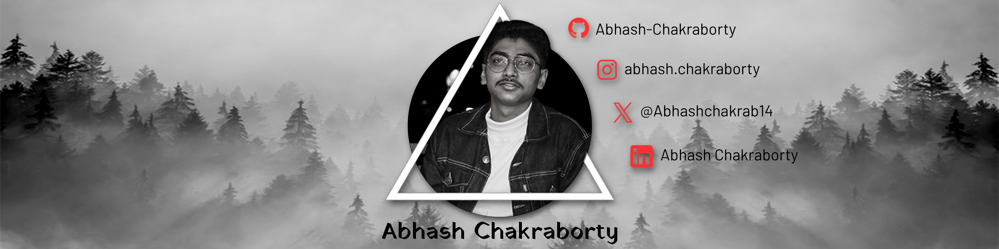

  

## Hi, I'm Abhash

I study AI and ML at VIT in Bhopal (Integrated M.Tech, final year) and write software for SAITS, a Swiss AI services company. Most of what I build puts a model inside something people use: agents that call real tools, photo search that stays on your own machine, a vault that hands a secret to a script only while it runs.

Right now I'm fine-tuning small open LLMs.

[Portfolio](https://abhashchakraborty.tech) · [Writing](https://abhashchakraborty.tech/writing) · [Résumé](https://abhashchakraborty.tech/resume) · [LinkedIn](https://www.linkedin.com/in/abhash-chakraborty-b78862247/) · [X](https://x.com/Abhashchakrab14)

## What I'm building

- **[PentaVault](https://abhashchakraborty.tech/projects/pentavault)**: runtime secrets for AI-assisted development. Secrets stay encrypted, access is deny-by-default, and the CLI injects a value only while a command runs. ([repo](https://github.com/PentaVault/PentaVault))
- **[CareerOS](https://abhashchakraborty.tech/projects/careeros)**: a career counsellor students can talk to. A voice agent interviews them, books sessions on their Google Calendar and answers only from official sources. ([live](https://careeros.abhashchakraborty.tech) · [repo](https://github.com/Abhash-Chakraborty/CareerOS))
- **[Find](https://abhashchakraborty.tech/projects/find)**: search your photos in plain language, fully self-hosted, so nothing leaves your machine. ([repo](https://github.com/Abhash-Chakraborty/Find))
- **[NexusFlow](https://abhashchakraborty.tech/projects/nexusflow)**: a canvas workflow designer that flags a broken process while you draw it, then simulates it step by step. ([live](https://nexusflow.abhashchakraborty.tech/designer) · [repo](https://github.com/Abhash-Chakraborty/NexusFlow))
- **[Allo](https://abhashchakraborty.tech/projects/allo)**: timed inventory holds where two carts can never claim the same last unit, enforced with Postgres row locks. ([live](https://allo.abhashchakraborty.tech) · [repo](https://github.com/Abhash-Chakraborty/Allo-Project))

More, including smaller builds, on [my projects page](https://abhashchakraborty.tech/projects).

## Open source

- **[Dokploy](https://github.com/Abhash-Chakraborty/dokploy)**: I maintain my own build of this self-hosted PaaS and run my servers on it. 138 commits and 16 releases add fleet SSH, a firewall that rolls itself back if it locks me out, an encrypted vault and restic backups with restore drills.
- **[mem0](https://github.com/Abhash-Chakraborty/mem0)**: a self-hosted memory server with an entity graph, webhooks and a one-container pgvector image, synced with upstream every week.
- **[recodehive](https://github.com/recodehive/recode-website/pulls?q=is%3Apr+author%3AAbhash-Chakraborty+is%3Amerged)**: 7 merged PRs, including Clerk sign-in, Algolia search and a fix that stopped exposing tokens in the browser.
- **[Gityzer](https://github.com/vansh-codes/Gityzer/pulls?q=is%3Apr+author%3AAbhash-Chakraborty+is%3Amerged)**: 9 merged PRs during Social Winter of Code 2025, among them the AI badge generator and SVG rendering. Second-largest contributor.
- **[Nyay Sathi](https://github.com/vikas872/nyay-sathi-clean/pull/1)**: my v2.0 upgrade moved this Indian-law assistant to agentic RAG with cited sources.

## Stack

Python, TypeScript and Rust. PyTorch, Hugging Face and LangChain for models; Next.js, FastAPI and Fastify for apps; PostgreSQL with pgvector, Redis and Convex for data; Docker, Linux and GitHub Actions to ship it.

  
  
  <picture>
    <source media="(prefers-color-scheme: dark)" srcset="https://raw.githubusercontent.com/Abhash-Chakraborty/Abhash-Chakraborty/output/github-snake-dark.svg" />
    <source media="(prefers-color-scheme: light)" srcset="https://raw.githubusercontent.com/Abhash-Chakraborty/Abhash-Chakraborty/output/github-snake.svg" />
    
  </picture>

